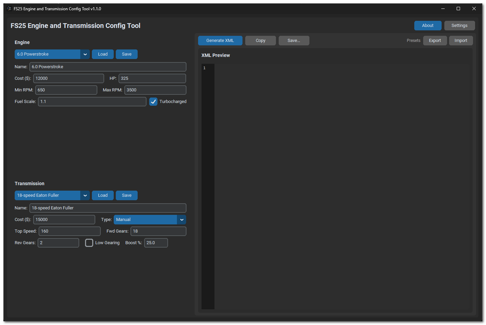

# FS25 Engine and Transmission Config Tool

Desktop app for generating Farming Simulator 25 engine and transmission XML configurations — with auto torque curves, gear ratio math, built-in presets, and FS25-compatible export.

---

## Screenshots

---

## Features

- Dark-mode GUI (CustomTkinter, with Tkinter fallback)
- Engine setup with auto-generated torque curves (turbo and naturally aspirated)
- Transmission support: Manual, Automatic, CVT, PowerShift
- Built-in engine and transmission presets, plus save/load for custom configs
- FS25-compatible XML export with syntax-highlighted preview
- Copy to clipboard and portable multi-platform builds

---

## Download

1. Open this repository’s **[Releases](https://github.com/CavemanTechandGamming/FS25-Engine-and-Transmission-Config-Tool/releases)** page.
2. Download the binary for your OS (no zip extract required for normal use):
   - **Windows portable** — `FS25ConfigTool-…-windows-portable.exe` (run directly)
   - **Windows installer** — `FS25ConfigTool-…-windows-setup.exe` (real Setup; Start Menu / optional desktop shortcut)
   - **Mac** — `FS25ConfigTool-…-mac-apple-silicon` or `…-mac-intel`
   - **Linux** — `FS25ConfigTool-…-<distro>` (e.g. `…-ubuntu`)
3. On macOS/Linux, make it executable if needed: `chmod +x FS25ConfigTool-*`

> **Linux note:** Farming Simulator 25 is not natively released for Linux, but it runs via [Steam Proton](https://www.protondb.com/app/2300320). A Linux build of this tool is included for modders on that platform.

---

## How to use

1. Open the app and configure an engine (or pick a preset).
2. Configure a transmission (type, gears, top speed, optional low gearing).
3. Generate engine XML, transmission XML, or a combined FS25 motor configuration.
4. Copy to clipboard or save to disk, then use the XML in your FS25 mod.

### Built-in presets

**Engines:** 7.3 / 6.0 / 6.7 Powerstroke · 5.9 / 6.7 Cummins

**Transmissions:** 10-speed Allison · 13-speed Eaton Fuller · 4-speed with Granny Gear · 18-speed Eaton Fuller

---

## Changelog

See [CHANGELOG.md](CHANGELOG.md) for version history.

---

## License

MIT — see [LICENSE](LICENSE).

---

## Contributing

Want to build from source or send a pull request? See [CONTRIBUTING.md](CONTRIBUTING.md).
