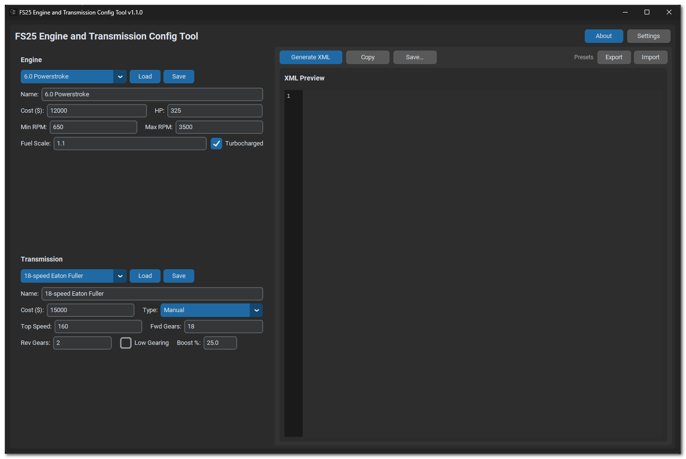
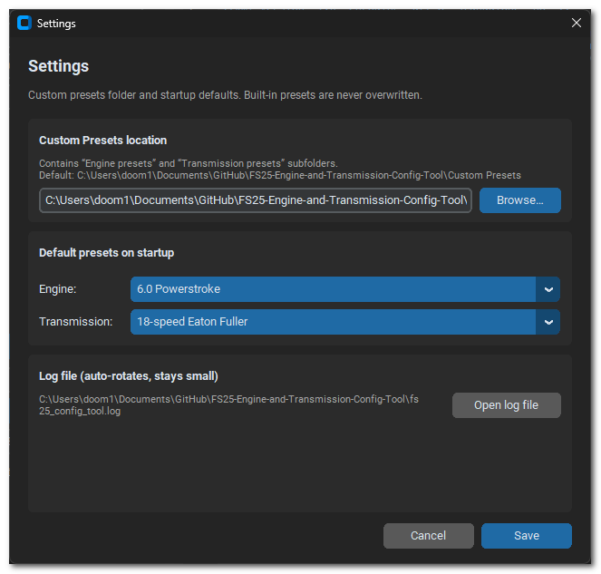
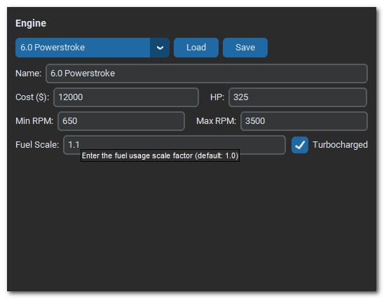
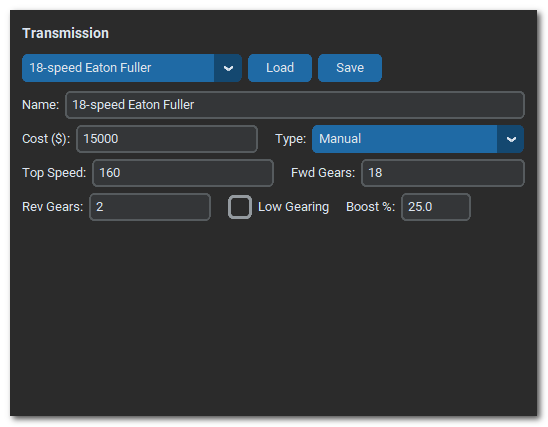
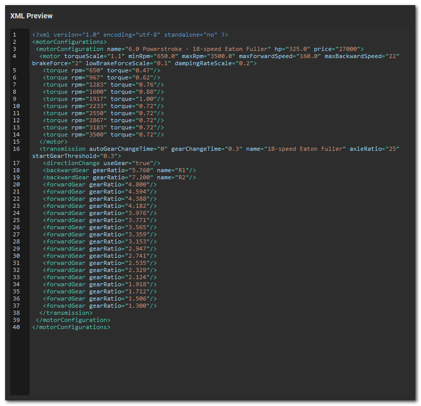

# FS25 Engine and Transmission Config Tool

Desktop app for generating Farming Simulator 25 engine and transmission XML configurations, with torque curves, gear ratio math, factory presets, and FS25-compatible export.

Here's the main window:

---

## Features

- Dark-mode GUI (CustomTkinter, with Tkinter fallback)
- Engine setup with auto-generated torque curves (turbo and naturally aspirated); shipped presets use real engine-dyno shapes (diesels and gas)
- Transmission support: Manual, Automatic, CVT, PowerShift
- Drive layout selector (FWD / RWD / 4WD / 6×6) that writes matching `differentialConfigurations`
- Optional custom Giants axle ratio (hidden for CVT)
- Factory presets as JSON under `Presets/Engine` and `Presets/Transmission`, plus custom presets in the same folders (default: next to the app)
- Settings for preset folder location, startup defaults, and log access
- FS25-compatible XML export with syntax-highlighted preview, copy, and save

---

## Download

1. Open this repository's **[Releases](https://github.com/CavemanTechandGamming/FS25-Engine-and-Transmission-Config-Tool/releases)** page.
2. Download the build for your OS:
   - **Windows portable:** `FS25 Engine and Transmission Config Tool-…-windows-portable.zip` (unzip, then run the `.exe`)
   - **Windows installer:** `FS25 Engine and Transmission Config Tool-…-windows-setup.exe` (run the Setup wizard)
   - **Mac:** `FS25 Engine and Transmission Config Tool-…-mac-apple-silicon` or `…-mac-intel`
   - **Linux:** `FS25 Engine and Transmission Config Tool-…-<distro>` (e.g. `…-ubuntu`)
3. On macOS/Linux, make it executable if needed: `chmod +x "FS25 Engine and Transmission Config Tool-"*`

> **Linux note:** Farming Simulator 25 is not natively released for Linux, but it runs via [Steam Proton](https://www.protondb.com/app/2300320). A Linux build of this tool is included for modders on that platform.

---

## How to use

1. Configure the **engine** (top-left). Pick a preset or edit fields, then **Save** if you want a custom engine preset.
2. Set **drive layout** (FWD / RWD / 4WD / 6×6) between Engine and Transmission. Wheel indices in the XML must match the target mod.
3. Configure the **transmission** (bottom-left) the same way. Optional **Custom axle ratio** overrides the generator default (hidden for CVT).
4. Click **Generate XML** to build the combined FS25 motor configuration (preview on the right).
5. **Copy** or **Save…** the preview for your mod.
6. Optional: open **Settings** to set the presets folder and default presets for next launch.

### Built-in presets

**Engines (17):** 7.3 / 6.0 / 6.7 Powerstroke · 5.9 / 6.7 Cummins · Ford 300 I6 · Chevy 350 / 305 / 454 · Ford 302 · Ford 351 Windsor · Ford 351 Cleveland · Ford 460 · Toyota 22R-E · Cummins 4BT · Willys Go-Devil · Isuzu 4BD1T

**Transmissions (21):** NP435 · T18 · Muncie SM465 · TH400 · Ford C6 · 700R4 · E4OD · 4L80-E · M5OD-R2 · ZF S5-42 · NV4500 · NV4500 Diesel · Allison 1000 5/6-spd · 10L1000 · Eaton RTLO-18913A · RTLO-22918B · Toyota W56 · Willys T-90 · Isuzu MSA-5G · Ford TorqShift 5R110

### More screenshots

---

## Changelog

See [CHANGELOG.md](CHANGELOG.md) for version history.

---

## License

MIT. See [LICENSE](LICENSE).

---

## Contributing

Want to build from source or send a pull request? See [CONTRIBUTING.md](CONTRIBUTING.md).
